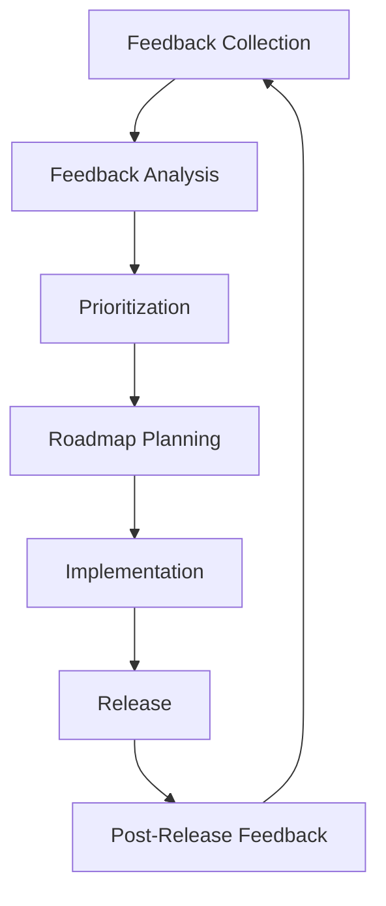

# Strategi Rilis dan Maintenance untuk Proyek rakitin

## Daftar Isi

1. [Eksekutif Summary](#eksekutif-summary)
2. [Status Proyek Saat Ini](#status-proyek-saat-ini)
3. [Strategi Rilis](#strategi-rilis)
   1. [Skema Versioning](#skema-versioning)
   2. [Proses Rilis](#proses-rilis)
   3. [Kriteria Rilis](#kriteria-rilis)
   4. [Template Changelog](#template-changelog)
   5. [Frekuensi Rilis](#frekuensi-rilis)
4. [Strategi Maintenance](#strategi-maintenance)
   1. [Kebijakan Dukungan Versi](#kebijakan-dukungan-versi)
   2. [Proses Bug Reports dan Security Issues](#proses-bug-reports-dan-security-issues)
   3. [Panduan Backporting Fixes](#panduan-backporting-fixes)
   4. [Deprecation dan End-of-Life](#deprecation-dan-end-of-life)
5. [Strategi Pertumbuhan Komunitas](#strategi-pertumbuhan-komunitas)
   1. [Menarik Kontributor Baru](#menarik-kontributor-baru)
   2. [Peran dan Tanggung Jawab](#peran-dan-tanggung-jawab)
   3. [Proses Menjadi Maintainer](#proses-menjadi-maintainer)
   4. [Manajemen Issue dan Pull Request](#manajemen-issue-dan-pull-request)
6. [Strategi Komunikasi](#strategi-komunikasi)
   1. [Channel Komunikasi](#channel-komunikasi)
   2. [Pengumuman Rilis](#pengumuman-rilis)
   3. [Mengumpulkan Feedback](#mengumpulkan-feedback)
7. [Strategi Pengembangan Jangka Panjang](#strategi-pengembangan-jangka-panjang)
   1. [Integrasi Feedback ke Roadmap](#integrasi-feedback-ke-roadmap)
   2. [Evaluasi dan Adopsi Teknologi Baru](#evaluasi-dan-adopsi-teknologi-baru)
   3. [Skalabilitas Proyek](#skalabilitas-proyek)
8. [Implementasi Strategi](#implementasi-strategi)
9. [Kesimpulan](#kesimpulan)

---

## Eksekutif Summary

Dokumen ini merinci strategi rilis dan maintenance untuk proyek open source **rakitin**, sebuah CLI untuk generate boilerplate modular backend dengan Node.js dan Express.js. Strategi ini mencakup pendekatan terstruktur untuk manajemen versi, proses rilis, maintenance, pertumbuhan komunitas, komunikasi, dan pengembangan jangka panjang.

Dengan mengimplementasikan strategi ini, proyek rakitin akan:
- Memiliki proses rilis yang konsisten dan terprediksi
- Menyediakan dukungan yang jelas bagi pengguna
- Membangun komunitas yang aktif dan berkontribusi
- Menjaga kualitas dan stabilitas proyek jangka panjang
- Memastikan pertumbuhan yang berkelanjutan

---

## Status Proyek Saat Ini

### Informasi Proyek
- **Nama Proyek**: rakitin
- **Versi Saat Ini**: 2.0.0
- **Lisensi**: MIT
- **Repository**: https://github.com/Reinvy/rakitin
- **Bahasa Utama**: JavaScript (Node.js)
- **Status**: Open Source, aktif dikembangkan

### Fitur Utama
- Command surface v2: `init` / `add` / `recipe` / `integrate` / `doctor` / `info` / `list`
  plus interactive legacy menu
- Generator modul dua arsitektur (Simple & Modular) dengan ORM opsional per jenis
- Mode headless penuh (`--json`, flags) untuk CI dan AI agent
- Integrasi router utama berbasis marker idempotent dengan backup `.bak`
- Recipes tingkat advanced: auth, swagger, test, docker

### Infrastruktur Saat Ini
- CI/CD GitHub Actions (test + lint + typecheck job)
- Testing Jest disk-based (>320 test, suite regression sebagai guard kebijakan)
- Dukungan multi-platform (Windows, macOS, Linux)
- Dukungan Node.js >=18 (runtime inquirer v12)

### Tantangan Saat Ini
- Onboarding kontributor eksternal pertama
- Migrasi bertahap template inline generator → file `.ejs`
- Review periodik akurasi dokumen roadmap terhadap kenyataan

---

## Strategi Rilis

### Skema Versioning

Proyek rakitin akan menggunakan **Semantic Versioning (SemVer)** dengan format `MAJOR.MINOR.PATCH`:

- **MAJOR**: Perubahan yang tidak kompatibel dengan backward compatibility
- **MINOR**: Penambahan fitur dengan tetap menjaga backward compatibility
- **PATCH**: Perbaikan bug yang kompatibel dengan backward compatibility

#### Format Version
```
X.Y.Z
```
Contoh:
- `1.0.0` - Rilis awal
- `1.0.1` - Patch release dengan bug fixes
- `1.1.0` - Minor release dengan penambahan fitur baru
- `2.0.0` - Major release dengan breaking changes

#### Pre-release Versions
Untuk versi pre-release, kita akan menggunakan format:
```
X.Y.Z-rc.N
```
Contoh:
- `1.1.0-rc.1` - Release candidate 1 untuk versi 1.1.0
- `2.0.0-beta.1` - Beta 1 untuk versi 2.0.0

### Proses Rilis

Proses rilis akan terdiri dari tahapan berikut:

#### 1. Tahap Perencanaan
- Menentukan fitur yang akan dimasukkan dalam rilis
- Membuat milestone di GitHub
- Membuat branch `release/X.Y.Z` dari branch `develop`

#### 2. Tahap Pengembangan
- Mengimplementasikan fitur dan perbaikan bug
- Melakukan testing dan code review
- Memastikan semua tes lulus
- Memperbarui dokumentasi

#### 3. Tahap Stabilisasi
- Membuat release candidate
- Melakukan testing oleh tim dan komunitas
- Memperbaiki issue yang ditemukan
- Mempersiapkan changelog

#### 4. Tahap Rilis
- Membuat tag di Git dengan format `vX.Y.Z`
- Membuat release di GitHub
- Mempublikasikan ke npm
- Mengumumkan rilis ke komunitas

#### 5. Tahap Pasca-Rilis
- Memantau feedback dan issue
- Memperbaiki masalah kritis jika ada
- Memulai perencanaan untuk rilis berikutnya

### Kriteria Rilis

#### Kriteria untuk Major Release (X.0.0)
- Perubahan yang tidak kompatibel dengan backward compatibility
- Perubahan arsitektur yang signifikan
- Penghapusan fitur yang sudah di-deprecate
- Perubahan API yang fundamental

#### Kriteria untuk Minor Release (X.Y.0)
- Penambahan fitur baru
- Peningkatan fitur yang ada
- Perubahan minor pada API yang tetap kompatibel
- Perbaikan dokumentasi yang signifikan

#### Kriteria untuk Patch Release (X.Y.Z)
- Perbaikan bug
- Perbaikan keamanan
- Perubahan kecil pada dokumentasi
- Perbaikan performa yang tidak mengubah API

### Template Changelog

Changelog akan mengikuti format [Keep a Changelog](https://keepachangelog.com/en/1.0.0/) dengan penyesuaian untuk proyek rakitin:

```markdown
# Changelog

Semua perubahan penting untuk proyek ini akan didokumentasikan di file ini.

Format ini didasarkan pada [Keep a Changelog](https://keepachangelog.com/en/1.0.0/),
dan proyek ini mengikuti [Semantic Versioning](https://semver.org/spec/v2.0.0.html).

## [Unreleased]

### Added
- Fitur baru yang akan datang

### Changed
- Perubahan pada fitur yang ada

### Deprecated
- Fitur yang akan dihapus di rilis mendatang

### Removed
- Fitur yang telah dihapus

### Fixed
- Perbaikan bug

### Security
- Perbaikan keamanan

## [X.Y.Z] - YYYY-MM-DD

### Added
- Deskripsi fitur yang ditambahkan ([#PR](link ke PR))

### Changed
- Deskripsi perubahan fitur ([#PR](link ke PR))

### Deprecated
- Deskripsi fitur yang di-deprecate ([#PR](link ke PR))

### Removed
- Deskripsi fitur yang dihapus ([#PR](link ke PR))

### Fixed
- Deskripsi perbaikan bug ([#Issue](link ke issue))

### Security
- Deskripsi perbaikan keamanan ([#Issue](link ke issue))
```

### Frekuensi Rilis

#### Minor Release
- **Frekuensi**: Setiap 4-6 minggu
- **Isi**: Fitur baru dan peningkatan yang telah direncanakan
- **Proses**: Melalui branch `develop` dengan code freeze 1 minggu sebelum rilis

#### Patch Release
- **Frekuensi**: Sesuai kebutuhan (biasanya 1-2 minggu setelah minor release jika diperlukan)
- **Isi**: Perbaikan bug kritis dan perbaikan keamanan
- **Proses**: Bisa langsung dari branch `main` untuk hotfixes

#### Major Release
- **Frekuensi**: Setiap 6-12 bulan
- **Isi**: Fitur besar, perubahan arsitektur, breaking changes
- **Proses**: Perencanaan minimal 1 bulan sebelum rilis dengan komunikasi ke komunitas

---

## Strategi Maintenance

### Kebijakan Dukungan Versi

#### Siklus Dukungan
- **Current Version**: Versi terbaru yang akan mendapatkan dukungan penuh
- **Previous Minor Version**: Dukungan terbatas (hanya perbaikan keamanan dan bug kritis)
- **Older Versions**: Tidak lagi didukung

#### Tabel Dukungan Versi

| Versi | Status | Dukungan | Berakhir |
|-------|--------|----------|---------|
| 2.x.x | Current | Penuh (fitur, bug, keamanan) | - |
| 1.x.x | Maintenance | Hanya bug dan keamanan kritis | 6 bulan setelah 2.0.0 |
| < 1.0 | Unsupported | Tidak ada | Segera |

#### Long Term Support (LTS)
Untuk versi mayor tertentu, mungkin ada rilis LTS dengan dukungan lebih lama:
- **Dukungan LTS**: Minimal 1 tahun setelah rilis mayor berikutnya
- **Kriteria**: Versi yang stabil dan banyak digunakan
- **Komunikasi**: Diinformasikan minimal 3 bulan sebelum akhir dukungan

### Proses Bug Reports dan Security Issues

#### Proses Bug Reports
1. **Pelaporan**
   - Pengguna melaporkan bug melalui GitHub Issues
   - Menggunakan template bug report
   - Memberikan informasi lengkap (reproduksi, lingkungan, dll)

2. **Triage**
   - Maintainer menilai severity dan priority bug
   - Memberikan label yang sesuai (bug, priority, dll)
   - Menentukan versi target untuk perbaikan

3. **Penanganan**
   - Bug kritis: diperbaiki dalam patch release berikutnya (1-3 hari)
   - Bug mayor: diperbaiki dalam minor release berikutnya
   - Bug minor: diperbaiki sesuai roadmap

4. **Komunikasi**
   - Memberikan update perkembangan ke reporter
   - Menginformasikan ketika bug telah diperbaiki
   - Menyertakan informasi di changelog

#### Proses Security Issues
1. **Pelaporan Terenkripsi**
   - Security issues dilaporkan melalui email terenkripsi
   - Alternatif: GitHub private vulnerability reporting

2. **Penilaian**
   - Tim menilai tingkat kerentanan (critical, high, medium, low)
   - Menentukan dampak dan langkah mitigasi sementara

3. **Perbaikan**
   - Kerentanan critical: diperbaiki dalam 48 jam
   - Kerentanan high: diperbaiki dalam 1 minggu
   - Kerentanan medium/low: diperbaiki sesuai roadmap

4. **Pengumuman**
   - Security advisory yang mendetail
   - Rekomendasi untuk upgrade
   - Changelog terpisah untuk security patches

### Panduan Backporting Fixes

#### Kriteria untuk Backporting
- Security patches yang mempengaruhi versi yang didukung
- Bug kritis yang mempengaruhi fungsionalitas utama
- Regresi yang diperkenalkan dalam rilis sebelumnya

#### Proses Backporting
1. **Identifikasi**
   - Menentukan commit yang memperbaiki masalah
   - Memastikan perbaikan tidak memperkenalkan dependensi baru

2. **Implementasi**
   - Membuat branch dari versi target (misal `backport/1.x.x`)
   - Menerapkan perubahan dengan hati-hati
   - Melakukan testing yang memadai

3. **Review dan Merge**
   - Code review oleh maintainer
   - Menggabungkan ke branch maintenance
   - Membuat tag untuk patch release

4. **Rilis**
   - Membuat patch release
   - Mendokumentasikan di changelog
   - Menginformasikan ke komunitas

### Deprecation dan End-of-Life

#### Kebijakan Deprecation
- **Minimum Notice**: 3 bulan untuk fitur minor, 6 bulan untuk fitur mayor
- **Komunikasi**: Peringatan di dokumentasi, code comments, dan logs
- **Migration Path**: Menyediakan panduan migrasi yang jelas
- **Support**: Membantu pengguna selama periode migrasi

#### Proses Deprecation
1. **Perencanaan**
   - Menentukan fitur yang akan di-deprecate
   - Menyusun alasan dan alternatif
   - Membuat timeline deprecation

2. **Implementasi**
   - Menambahkan peringatan deprecation di code
   - Memperbarui dokumentasi
   - Membuat issue untuk tracking

3. **Komunikasi**
   - Mengumumkan di release notes
   - Memberikan informasi di channel komunikasi
   - Membuat panduan migrasi

4. **Penghapusan**
   - Menghapus fitur sesuai timeline
   - Memperbarui changelog
   - Memastikan tidak ada dampak yang tidak terduga

#### End-of-Life Policy
- **Komunikasi**: Diinformasikan minimal 6 bulan sebelum EOL
- **Support**: Tidak ada dukungan setelah tanggal EOL
- **Arsip**: Dokumentasi tetap tersedia tapi tidak diperbarui
- **Migration**: Memberikan panduan ke versi yang didukung

---

## Strategi Pertumbuhan Komunitas

### Menarik Kontributor Baru

#### Program Onboarding
1. **Documentation First**
   - Meningkatkan dokumentasi untuk kontributor
   - Membuat tutorial kontribusi langkah demi langkah
   - Menyediakan contoh-contoh praktis

2. **Good First Issues**
   - Memberi label "good first issue" pada task yang cocok untuk pemula
   - Memberikan panduan detail untuk menyelesaikan issue
   - Menyediakan mentorship untuk kontributor baru

3. **Welcome Program**
   - Mengirim pesan selamat datang kepada kontributor baru
   - Memberikan pengenalan kepada komunitas
   - Mengenali kontribusi pertama

#### Outreach Program
1. **Content Creation**
   - Membuat tutorial dan artikel tentang rakitin
   - Membuat video demonstrasi
   - Berpartisipasi dalam forum dan komunitas developer

2. **Events**
   - Mengadakan workshop online
   - Berpartisipasi dalam conference dan meetup
   - Mengadakan hackathon dengan fokus pada rakitin

3. **Partnership**
   - Kolaborasi dengan komunitas developer lokal
   - Kerjasama dengan institusi pendidikan
   - Partnership dengan perusahaan teknologi

### Peran dan Tanggung Jawab

#### Peran dalam Proyek
1. **Project Lead**
   - Tanggung jawab: arah strategis, visi proyek
   - Kewenangan: keputusan akhir untuk konflik
   - Penerimaan: diangkat oleh komunitas maintainer

2. **Maintainer**
   - Tanggung jawab: review code, manajemen rilis, teknis
   - Kewenangan: merge PR, manage issues, label issues
   - Penerimaan: dari kontributor aktif melalui voting

3. **Contributor**
   - Tanggung jawab: mengembangkan fitur, memperbaiki bug
   - Kewenangan: submit PR, participate in discussions
   - Penerimaan: siapa saja yang berkontribusi

4. **Community Manager**
   - Tanggung jawab: manajemen komunitas, komunikasi
   - Kewenangan: manage communication channels
   - Penerimaan: diangkat oleh maintainer

#### Tanggung Jawab Detail
1. **Maintainer Responsibilities**
   - Review PR dalam waktu 3-5 hari kerja
   - Memastikan kualitas kode sesuai standar
   - Menangani issue dan memberikan label yang tepat
   - Membantu dan membimbing kontributor baru
   - Berpartisipasi dalam diskusi teknis

2. **Contributor Expectations**
   - Mengikuti coding standards yang telah ditetapkan
   - Melakukan testing untuk kontribusi mereka
   - Memberikan dokumentasi yang memadai
   - Merespons feedback dan review dengan cepat
   - Menghormati keputusan maintainer

3. **Community Manager Responsibilities**
   - Memoderasi diskusi di channel komunikasi
   - Membuat konten untuk pengumuman
   - Mengumpulkan feedback dari komunitas
   - Mengorganisir event komunitas

### Proses Menjadi Maintainer

#### Kriteria Menjadi Maintainer
1. **Kriteria Teknis**
   - Minimal 5 PR yang telah di-merge
   - Berkontribusi pada fitur utama atau perbaikan kritis
   - Memahami arsitektur dan best practices proyek
   - Kemampuan untuk melakukan code review yang berkualitas

2. **Kriteria Non-Teknis**
   - Partisipasi aktif dalam diskusi
   - Membantu kontributor lain
   - Menghormati pandangan orang lain
   - Konsistensi dalam kontribusi minimal 3 bulan

#### Proses Nominasi
1. **Nominasi**
   - Maintainer atau kontributor dapat menominasikan kandidat
   - Kandidat dapat menominasikan diri sendiri
   - Nominasi disertai dengan alasan dan bukti kontribusi

2. **Review**
   - Tim maintainer existing akan mereview nominasi
   - Mengevaluasi kontribusi kandidat
   - Melakukan diskusi dengan kandidat

3. **Voting**
   - Voting dilakukan oleh maintainer existing
   - Membutuhkan mayoritas sederhana (50% + 1)
   - Hasil voting diumumkan ke komunitas

4. **Onboarding**
   - Memberikan akses yang diperlukan (GitHub, npm, etc)
   - Mentoring oleh maintainer senior
   - Pengenalan ke komunitas

#### Evaluasi Berkala
- **Period**: Evaluasi setiap 6 bulan
- **Kriteria**: Kontribusi, partisipasi, kualitas kerja
- **Process**: Self-assessment dan peer review
- **Consequence**: Mungkin perubahan peran jika diperlukan

### Manajemen Issue dan Pull Request

#### Issue Management
1. **Issue Templates**
   - Bug Report
   - Feature Request
   - Documentation Issue
   - Question

2. **Issue Triage**
   - Memberikan label yang sesuai
   - Menentukan priority (low, medium, high, critical)
   - Menetapkan milestone
   - Menugaskan ke maintainer jika perlu

3. **Issue Lifecycle**
   - Open → Triage → In Progress → Review → Done
   - Issue tanpa aktivitas selama 30 hari akan diberi label "stale"
   - Issue stale tanpa aktivitas 14 hari kemudian akan ditutup

#### Pull Request Management
1. **PR Templates**
   - Feature PR
   - Bug Fix PR
   - Documentation PR

2. **PR Review Process**
   - Automated checks harus lulus (CI, tests)
   - Minimal 1 approval dari maintainer
   - Memenuhi checklist yang telah ditentukan
   - Menyertakan changelog yang relevan

3. **PR Lifecycle**
   - Draft → Ready for Review → In Review → Approved → Merged
   - PR tanpa aktivitas selama 14 hari akan diberi label "stale"
   - PR stale tanpa aktivitas 7 hari kemudian akan ditutup

#### Label System
1. **Type Labels**
   - `bug`: Issue yang melaporkan bug
   - `enhancement`: Permintaan fitur baru
   - `documentation`: Issue terkait dokumentasi
   - `question`: Pertanyaan tentang proyek

2. **Priority Labels**
   - `priority-critical`: Harus diperbaiki segera
   - `priority-high`: Prioritas tinggi
   - `priority-medium`: Prioritas menengah
   - `priority-low`: Prioritas rendah

3. **Status Labels**
   - `status-in-progress`: Sedang dikerjakan
   - `status-awaiting-feedback`: Menunggu feedback
   - `status-review-needed`: Perlu review
   - `status-ready-to-merge`: Siap di-merge

---

## Strategi Komunikasi

### Channel Komunikasi

#### Primary Channels
1. **GitHub**
   - **Issues**: Untuk bug reports dan feature requests
   - **Discussions**: Untuk diskusi umum, Q&A, dan ide
   - **Pull Requests**: Untuk review kode dan kontribusi
   - **Releases**: Untuk pengumuman rilis dan changelog

2. **Documentation**
   - **README.md**: Informasi umum dan getting started
   - **CONTRIBUTING.md**: Panduan kontribusi
   - **docs/**: Dokumentasi mendalam tentang fitur dan arsitektur
   - **Changelog**: Catatan perubahan untuk setiap rilis

#### Secondary Channels
1. **Communication Platform**
   - **Discord**: Untuk diskusi real-time, bantuan, dan komunitas
     - `#general`: Diskusi umum
     - `#help`: Bantuan dan pertanyaan teknis
     - `#contributors`: Diskusi untuk kontributor
     - `#announcements`: Pengumuman resmi
   - **Newsletter**: Update berkala tentang perkembangan proyek

2. **Social Media**
   - **Twitter/X**: Untuk update singkat dan pengumuman
   - **LinkedIn**: Untuk update profesional dan networking
   - **Dev.to**: Untuk artikel tutorial dan panduan

### Pengumuman Rilis

#### Rilis Communication Plan
1. **Pre-Release**
   - Mengumumkan timeline rilis mendatang
   - Memberikan preview fitur yang akan datang
   - Meminta feedback dari komunitas

2. **Release Day**
   - Pengumuman di semua channel komunikasi
   - Release notes detail di GitHub
   - Tutorial singkat untuk fitur baru

3. **Post-Release**
   - Memantau feedback dan issue
   - Membuat konten tutorial untuk fitur baru
   - Mengadakan Q&A session jika perlu

#### Release Announcement Template
```markdown
# 🚀 rakitin vX.Y.Z Released!

Kami dengan gembira mengumumkan rilis rakitin versi X.Y.Z!

## Highlights
- [Fitur utama 1]
- [Fitur utama 2]
- [Perbaikan penting]

## What's New
- Deskripsi fitur baru dengan link ke dokumentasi

## What's Changed
- Deskripsi perubahan penting

## What's Fixed
- Deskripsi perbaikan bug

## Getting Started
```bash
npm install -g rakitin@latest
```

## Documentation
[Link ke dokumentasi]

## Support
- GitHub Issues: [link]
- Discord: [link]
- Twitter: [@username]

## How to Contribute
[Link ke contributing guide]

Terima kasih kepada semua kontributor!
[@kontributor1] [@kontributor2] ...
```

### Mengumpulkan Feedback

#### Feedback Channels
1. **Structured Feedback**
   - **Surveys**: Survey berkala tentang penggunaan dan kebutuhan
   - **GitHub Discussions**: Diskusi terstruktur tentang topik spesifik
   - **User Interviews**: Wawancara dengan pengguna aktif

2. **Informal Feedback**
   - **Discord**: Diskusi tidak formal di channel yang relevan
   - **Social Media**: Komentar dan interaksi di media sosial
   - **Direct Communication**: Email atau chat langsung

#### Feedback Collection Process
1. **Collection**
   - Membuat kuesioner dengan pertanyaan terstruktur
   - Monitoring diskusi di social media dan Discord
   - Menganalisis issue dan PR yang diajukan

2. **Analysis**
   - Mengkategorikan feedback (bug, feature, enhancement)
   - Mengidentifikasi pola dan tren
   - Menentukan prioritas berdasarkan dampak

3. **Action**
   - Membuat issue untuk feedback yang valid
   - Mengintegrasikan ke roadmap
   - Memberikan respon kepada pengguna

#### Feedback Integration
- **Roadmap Planning**: Feedback mempengaruhi prioritas roadmap
- **Feature Development**: Feedback spesifik mempengaruhi implementasi
- **Documentation Improvement**: Feedback mempengaruhi penulisan dokumentasi
- **Community Support**: Feedback mempengaruhi strategi dukungan

---

## Strategi Pengembangan Jangka Panjang

### Integrasi Feedback ke Roadmap

#### Roadmap Development Process
1. **Feedback Collection**
   - Mengumpulkan feedback dari berbagai sumber
   - Menganalisis pola dan kebutuhan umum
   - Mengidentifikasi gap antara kebutuhan dan fitur saat ini

2. **Prioritization**
   - Menggunakan framework seperti RICE (Reach, Impact, Confidence, Effort)
   - Menilai setiap fitur berdasarkan nilai dan biaya
   - Mempertimbangkan tujuan strategis proyek

3. **Roadmap Creation**
   - Membuat timeline untuk fitur-fitur prioritas
   - Menentukan milestone untuk setiap kuartal
   - Menyesuaikan dengan kapasitas tim

#### Roadmap Communication
- **Public Roadmap**: Roadmap yang dapat diakses publik
- **Regular Updates**: Update perkembangan setiap bulan
- **Adjustment Communication**: Mengomunikasikan perubahan roadmap

#### Feedback Integration Framework


### Evaluasi dan Adopsi Teknologi Baru

#### Technology Evaluation Process
1. **Identification**
   - Mengidentifikasi teknologi baru yang relevan
   - Memantau tren industri dan komunitas
   - Mengumpulkan saran dari komunitas

2. **Evaluation**
   - Menilai teknologi berdasarkan kriteria:
     - Maturity dan stability
     - Kompatibilitas dengan stack saat ini
     - Dukungan komunitas dan dokumentasi
     - Performa dan skalabilitas
     - Keamanan

3. **Pilot Implementation**
   - Membuat proof of concept
   - Menguji dalam lingkungan terkontrol
   - Mengevaluasi hasil dan tantangan

4. **Decision**
   - Memutuskan untuk mengadopsi atau menolak
   - Membuat rencana implementasi jika diadopsi
   - Mengomunikasikan keputusan ke komunitas

#### Technology Adoption Framework
- **Core Technologies**: Teknologi fundamental (misal Node.js, Express)
- **Supporting Technologies**: Teknologi pendukung (misal ORM, testing)
- **Experimental Technologies**: Teknologi yang sedang dievaluasi

#### Technology Sunset Process
- **Evaluation**: Menilai teknologi yang sudah tidak relevan
- **Communication**: Mengomunikasikan rencana penggantian
- **Migration**: Membuat panduan migrasi
- **Deprecation**: Mengikuti kebijakan deprecation

### Skalabilitas Proyek

#### Skalabilitas Teknis
1. **Architecture Scalability**
   - Memastikan arsitektur mendukung pertumbuhan fitur
   - Menerapkan modular design untuk memudahkan ekstensi
   - Membuat API yang jelas untuk integrasi eksternal

2. **Performance Scalability**
   - Menjaga performa CLI seiring bertambahnya fitur
   - Optimasi untuk penggunaan resource yang efisien
   - Implementasi caching jika diperlukan

3. **Maintenance Scalability**
   - Membangun sistem testing yang skalabel
   - Implementasi CI/CD yang otomatis
   - Membuat dokumentasi yang mudah dikelola

#### Skalabilitas Komunitas
1. **Contributor Growth**
   - Membangun proses onboarding yang efisien
   - Menciptakan budaya yang mendukung kontributor baru
   - Menyediakan resources untuk pembelajaran

2. **Governance Scalability**
   - Membangun struktur keputusan yang skalabel
   - Menyesuaikan proses dengan pertumbuhan komunitas
   - Mendefinisikan peran dan tanggung jawab dengan jelas

3. **Support Scalability**
   - Membangun sistem dukungan yang dapat menangani pertumbuhan pengguna
   - Membuat dokumentasi self-service yang komprehensif
   - Mengembangkan program ambassador atau volunteer

#### Skalabilitas Sumber Daya
1. **Resource Planning**
   - Merencanakan kebutuhan sumber daya untuk pertumbuhan
   - Mencari potensi sponsorship atau dukungan
   - Mengoptimalkan penggunaan sumber daya yang ada

2. **Sustainability**
   - Membangun model yang berkelanjutan untuk jangka panjang
   - Menjaga keseimbangan antara inovasi dan stabilitas
   - Merencanakan untuk pergantian atau pensiun maintainer

---

## Implementasi Strategi

### Timeline Implementasi

#### Fase 1: Foundation (Bulan 1-2)
- [ ] Membuat template changelog
- [ ] Membuat issue dan PR templates
- [ ] Menyiapkan channel komunikasi (Discord, dll)
- [ ] Membuat documentation improvement plan
- [ ] Mendefinisikan dengan jelas peran dan tanggung jawab

#### Fase 2: Core Implementation (Bulan 3-4)
- [ ] Implementasi proses rilis untuk versi berikutnya
- [ ] Implementasi maintenance process
- [ ] Membuat roadmap publik
- [ ] Mulai program onboarding untuk kontributor baru
- [ ] Implementasi feedback collection system

#### Fase 3: Expansion (Bulan 5-6)
- [ ] Meningkatkan outreach program
- [ ] Mengembangkan partnership dengan komunitas
- [ ] Membangun automation untuk proses maintenance
- [ ] Menciptakan program penghargaan untuk kontributor
- [ ] Evaluasi dan penyesuaian strategi

### Metrics for Success

#### Rilis Metrics
- Frekuensi rilis sesuai target
- Waktu dari issue reported ke fixed
- Jumlah download dan adopsi versi baru
- Feedback positif dari pengguna tentang rilis

#### Maintenance Metrics
- Jumlah bug yang diperbaiki per bulan
- Waktu respons untuk security issues
- Jumlah versi yang didukung
- Tingkat kepuasan pengguna

#### Komunitas Metrics
- Jumlah kontributor aktif per bulan
- Jumlah PR yang diajukan dan di-merge
- Pertumbuhan anggota di channel komunikasi
- Partisipasi dalam event dan diskusi

#### Proyek Metrics
- Pertumbuhan pengguna (npm downloads)
- Coverage dan kualitas testing
- Kualitas dan kelengkapan dokumentasi
- Dampak proyek (penggunaan, kontribusi, dll)

### Risiko dan Mitigasi

#### Risiko 1: Sumber Daya Terbatas
- **Deskripsi**: Keterbatasan waktu dan tenaga untuk maintain proyek
- **Mitigasi**: 
  - Membangun proses otomatisasi
  - Mendorong lebih banyak kontributor
  - Fokus pada fitur critical

#### Risiko 2: Burnout Maintainer
- **Deskripsi**: Maintainer mengalami kelelahan karena beban
- **Mitigasi**:
  - Mendistribusikan tanggung jawab
  - Menetapkan batas waktu kerja
  - Menyediakan dukungan komunitas

#### Risiko 3: Pertumbuhan yang Tidak Terkendali
- **Deskripsi**: Proyek tumbuh terlalu cepat melebihi kapasitas
- **Mitigasi**:
  - Perencanaan pertumbuhan yang hati-hati
  - Prioritasi berdasarkan dampak
  - Menyesuaikan ekspektasi komunitas

#### Risiko 4: Perubahan Teknologi
- **Deskripsi**: Perubahan teknologi yang mempengaruhi proyek
- **Mitigasi**:
  - Pemantauan tren teknologi
  - Arsitektur yang fleksibel
  - Perencanaan migrasi jika diperlukan

---

## Kesimpulan

Strategi rilis dan maintenance ini memberikan kerangka kerja komprehensif untuk pengembangan berkelanjutan proyek rakitin. Dengan implementasi strategi ini, proyek rakitin akan:

1. **Memiliki proses rilis yang terstruktur** yang memastikan kualitas dan stabilitas
2. **Menyediakan dukungan yang jelas** bagi pengguna dengan kebijakan versi yang terdefinisi
3. **Membangun komunitas yang aktif dan berkontribusi** melalui program onboarding dan partisipasi
4. **Menjaga komunikasi yang efektif** dengan pengguna dan kontributor
5. **Mengembangkan proyek secara berkelanjutan** dengan roadmap yang jelas dan evaluasi teknologi

Strategi ini bukan statis melainkan dokumen hidup yang akan terus dievaluasi dan diperbarui seiring dengan pertumbuhan proyek. Dengan komitmen dari maintainer dan dukungan komunitas, rakitin dapat berkembang menjadi CLI generator pilihan utama untuk pengembangan backend Express.js di Indonesia dan secara global.

Implementasi strategi ini memerlukan konsistensi, disiplin, dan adaptabilitas. Melalui pendekatan terstruktur ini, kita memastikan bahwa proyek rakitin tidak hanya bertahan tetapi juga berkembang dan memberikan nilai yang lebih besar kepada komunitas pengembang.